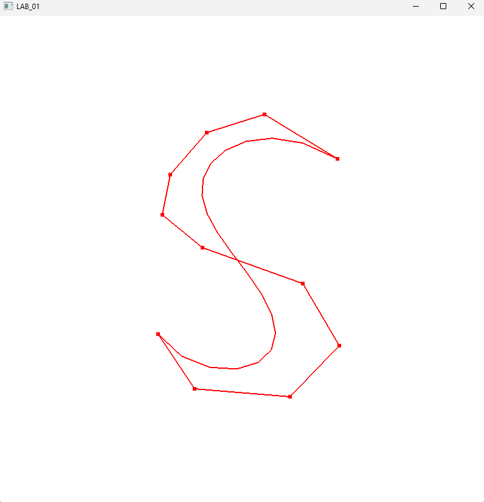
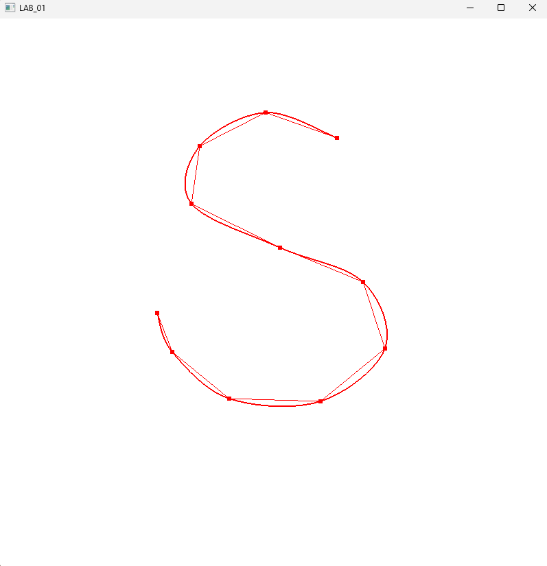
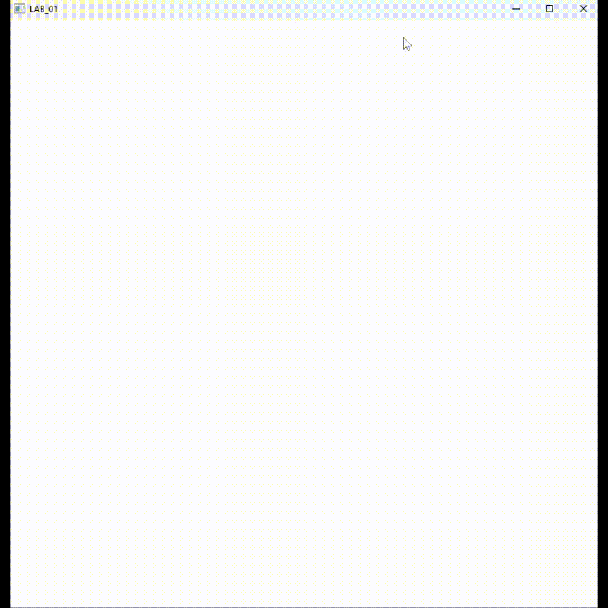
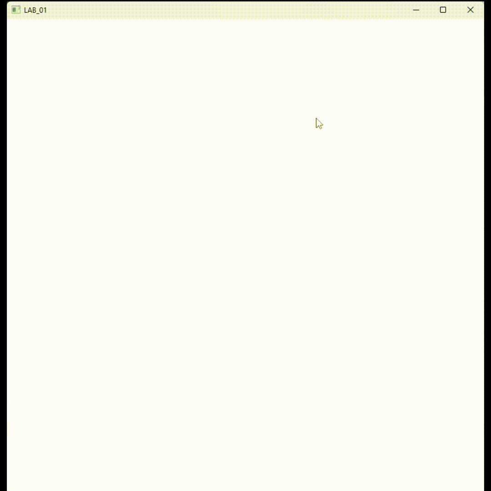

# Interactive curves and Geometric continuity
## Project Objectives
<table align="center">
  <tr>
    <td align="center">
      <br />
      <sub><b>Bézier Evaluation</b></sub>
    </td>
    <td align="center">
      <br />
      <sub><b>Catmull-Rom Interpolation</b></sub>
    </td>
  </tr>
</table>
This project focuses on the mathematical implementation and real-time visualization of parametric curves. The following core features were implemented as part of the computational geometry study:
* **Bézier Curve Evaluation**: Implementation of the **de Casteljau** algorithm to generate curves from a set of user-defined control points (CP).
* **Dynamic Control Point Manipulation**: Interactive modification of the curve's shape via real-time mouse-drag callbacks.
* **Catmull-Rom**: Generation of piecewise interpolating Bézier curves for smooth path construction.

*Developed as part of the Fundamentals of Computer Graphics course in Computer Engineering in Alma Mater Studiorum, Bologna, Italy.*

## Technical Implementation: De Casteljau’s Algorithm
<p align="center">
  
</p>

The core of the Bézier evaluation system is based on **De Casteljau's algorithm**, a numerically stable method used to obtain the points of a parametric curve $f(t)$ through geometric construction. While the algorithm is theoretically recursive, it has been implemented **iteratively** in this project to optimize performance and stack usage, which is a critical requirement for real-time graphics applications.

### **1. Mathematical Evaluation**
Since a Bézier curve is a continuous function, it must be discretized into a **polyline** for visualization.The implementation samples the curve at **$N=201$ equidistant points** along the parameter $t \in [0, 1]$. 

For each point, the algorithm performs successive linear interpolations (**LERP**) between control points until a single point on the curve is reached. The recursive LERP process follows this logic:
$$P_i^k = (1 - t)P_i^{k-1} + tP_{i+1}^{k-1}$$

### **2. Core Algorithm Implementation (C++)**
The following function evaluates the curve's coordinates for a specific parameter $t$. The outer loop manages the levels of interpolation, while the inner loop computes the LERP between adjacent points.

```cpp
// Evaluates a single point on the Bézier curve at parameter t
void de_casteljau_alghoritm(float t, float* result, int num_points, float points[][2]) {
    float cord_X[MaxNumPts];
    float cord_Y[MaxNumPts];

    // Initialize temporary coordinate arrays with control points
    for (int i = 0; i < num_points; i++) {
        cord_X[i] = points[i][0];
        cord_Y[i] = points[i][1];
    }

    // Iterative LERP process for numerical stability
    for (int i = 1; i < num_points; i++) {
        for (int j = 0; j < num_points - i; j++) {
            cord_X[j] = (1 - t) * cord_X[j] + t * cord_X[j + 1];
            cord_Y[j] = (1 - t) * cord_Y[j] + t * cord_Y[j + 1];
        }
    }

    // Resulting point on the curve
    result[0] = cord_X[0];
    result[1] = cord_Y[0];
}
```

### **3. Integration in the Rendering Loop**

The drawScene function manages the discretization process. It iterates through the defined steps (200 segments), invoking the algorithm for each t to update the vertex arrays used for rendering.
```cpp
void drawScene_deCasteljau(void) {
    if (NumPts > 1) {
        float result_dc[2];
        int steps_per_segment = 200; // Number of steps for discretization

        for (int j = 0; j <= steps_per_segment; j++) {
            // Calculate parameter t and evaluate position
            de_casteljau_alghoritm((GLfloat)j / steps_per_segment, result_dc, NumPts, vPositions_CP);
            
            // Store results in the vertex buffer for OpenGL rendering
            if (index_cat < MaxNumPts) {
                vPositions_C[index_cat][0] = result_dc[0];
                vPositions_C[index_cat][1] = result_dc[1];
                index_cat++;
            }
        }
    }
}
```
## **Real-Time Interaction: Interactive Control Point Manipulation**
<p align="center">
  
</p>

To provide an intuitive modeling experience, the application implements a **dynamic mouse-drag system**. This allows users to reshape curves in real-time by interacting directly with the control points (CP).

### **1. Interaction State Management**
The system logic is integrated into the **GLFW callback system** (specifically within `gestione_callback.cpp`). The interaction state is managed via two primary variables:
* `isDragging` (**bool**): Tracks whether a drag operation is currently active.
* `selectedPoint` (**int**): Stores the index of the point being manipulated (set to `-1` when idle).

### **2. Input Logic & Proximity Selection**
The `mouse_button_callback` distinguishes between **creating** a new point and **editing** an existing one. It uses a proximity-based selection logic:
1. When a click occurs, the system calculates the **Euclidean distance** between the cursor and all existing control points.
2. If the distance is below a specific **threshold** ($0.05f$), that point is selected for dragging.
3. If no point is within range, a new control point is spawned at the cursor's coordinates.

### **3. Mouse Button Callback (C++)**
```cpp
void mouse_button_callback(GLFWwindow* window, int button, int action, int mods) {
    if (button == GLFW_MOUSE_BUTTON_LEFT) {
        if (action == GLFW_PRESS) {
            float threshold = 0.05f; // Selection sensitivity
            selectedPoint = -1;

            // Iterate through points to check for proximity selection
            for (int i = 0; i < NumPts; ++i) {
                float dx = vPositions_CP[i][0] - xPos;
                float dy = vPositions_CP[i][1] - yPos;

                // Threshold check using distance squared for performance
                if (sqrt(dx * dx + dy * dy) < threshold) {
                    selectedPoint = i;
                    break; 
                }
            }

            // Trigger dragging state or create a new point
            if (selectedPoint != -1) {
                isDragging = true;
            } else {
                addNewPoint(xPos, yPos);
            }
        }
        // Reset state on button release
        else if (action == GLFW_RELEASE) {
            isDragging = false;
            selectedPoint = -1;
        }
    }
}
```
## **Piecewise Bézier Curves & Catmull-Rom Splines**

<p align="center">
  
</p>


Unlike a single high-degree Bézier curve, this project implements **piecewise Bézier curves** to ensure a more stable and predictable behavior. This approach provides **local control**: modifying one control point only affects the adjacent segments rather than the entire curve.

To guarantee that the curve passes exactly through the control points (**interpolation**) while maintaining a smooth transition, I implemented the **Catmull-Rom Spline** algorithm, ensuring **$C^1$ continuity** (velocity continuity) at each junction.

### **1. Mathematical Conversion to Cubic Bézier**
For each segment between $P_i$ and $P_{i+1}$, the algorithm constructs a cubic Bézier curve. This requires calculating two additional internal control points, $P_i^+$ and $P_{i+1}^-$, based on the tangents ($m_i$) at the junctions:

**Tangent Calculation:**
$$m_i = \frac{P_{i+1} - P_{i-1}}{2}$$

**Bézier Control Points Derivation:**
$$P_i^{+} = P_{i} + \frac{m_i}{3}$$
$$P_{i+1}^{-} = P_{i+1} - \frac{m_{i+1}}{3}$$

### **2. Algorithmic Steps**
The implementation iterates through each segment $(P_i, P_{i+1})$ and performs the following:
1. **Point Identification**: Selects the four required points $(P_{i-1}, P_i, P_{i+1}, P_{i+2})$, handling boundary conditions at the curve's endpoints.
2. **Tangent Computation**: Calculates the slopes $m_i$ and $m_{i+1}$.
3. **Bézier Mapping**: Converts the spline data into the 4 control points of a cubic Bézier segment (`temp_bezier`).
4. **Sampling & Rendering**: Discretizes the segment by invoking the De Casteljau algorithm and storing the resulting vertices.

### **3. Implementation Snippet (C++)**
```cpp
if (NumPts > 1) {
    float result_dc[2];
    int index_cat = 0;

    for (int i = 0; i < NumPts - 1; i++) {
        float* pi_minus_1;
        float* pi = vPositions_CP[i];
        float* pi_plus_1 = vPositions_CP[i + 1];
        float* pi_plus_2;

        // Boundary handling for endpoints
        if (i == 0) pi_minus_1 = vPositions_CP[i];
        else pi_minus_1 = vPositions_CP[i - 1];
        
        if (i >= NumPts - 2) pi_plus_2 = vPositions_CP[i + 1];
        else pi_plus_2 = vPositions_CP[i + 2];

        // Calculate tangents (slopes)
        float mix = (pi_plus_1[0] - pi_minus_1[0]) / 2.0f;
        float miy = (pi_plus_1[1] - pi_minus_1[1]) / 2.0f;
        float mi_plus_1x = (pi_plus_2[0] - pi[0]) / 2.0f;
        float mi_plus_1y = (pi_plus_2[1] - pi[1]) / 2.0f;

        float temp_bezier[4][2];
        // Define Cubic Bézier control points
        temp_bezier[0][0] = pi[0];
        temp_bezier[0][1] = pi[1];
        
        temp_bezier[1][0] = pi[0] + mix / 3.0f; // Pi+
        temp_bezier[1][1] = pi[1] + miy / 3.0f;
        
        temp_bezier[2][0] = pi_plus_1[0] - mi_plus_1x / 3.0f; // P(i+1)-
        temp_bezier[2][1] = pi_plus_1[1] - mi_plus_1y / 3.0f;
        
        temp_bezier[3][0] = pi_plus_1[0];
        temp_bezier[3][1] = pi_plus_1[1];

        // Adaptive discretization step
        int steps_per_segment = 100 / (NumPts - 1);
        if (steps_per_segment == 0) steps_per_segment = 1;
        
        // Render segment using De Casteljau evaluation
        for (int j = 0; j <= steps_per_segment; j++) {
            de_casteljau_alghoritm((GLfloat)j / steps_per_segment, result_dc, 4, temp_bezier);
            if (index_cat < MaxNumPts) {
                vPositions_C[index_cat][0] = result_dc[0];
                vPositions_C[index_cat][1] = result_dc[1];
                index_cat++;
            }
        }
    }
}
```
